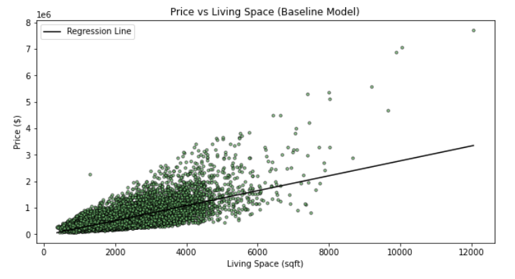
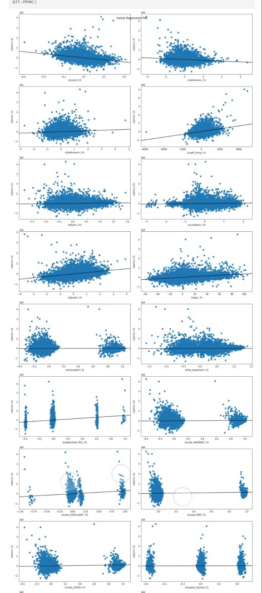

# KING COUNTY HOUSING AFFORDABILITY 
 

# OVERVIEW 
A real estate agency from King County, Seattle hired us for a project to analyse how different factors affect prices of homes.The aim of this analysis is to build a multiple linear regression model that predicts the prices of houses in King County, Seattle.  

# BUSINESS UNDERSTANDING  

The success of a real estate transaction depends on several factors, including the location, the size of the property, the condition of the property, the amenities, and the current market conditions. The housing market is subject to various external factors such as interest rates, economic conditions, and government policies that can impact the demand and supply of properties. 

# business objectives 
$1$ Develop a pricing model  
$2$ Refine marketing strategies     
$3$ Analyze seasonal trends  
$4$ Optimize home renovations 

# DATA UNDERSTANDING 
The dataset contains information about the houses in King County, Seattle. The dataset has 21 variables including the price, number of bedrooms, bathrooms, square footage of the living area, and other variables. The dataset contains 21,597 observations. 

 Column Names and Descriptions for King County Data Set we used:  
* `date` - Date house was sold  
* `price` - Sale price (prediction target) 
* `bedrooms` - Number of bedrooms 
* `bathrooms` - Number of bathrooms 
* `sqft_living` - Square footage of living space in the home  
* `floors` - Number of floors (levels) in house 
* `view` - Quality of view from house 
* `condition` - How good the overall condition of the house is. Related to maintenance of house. 
* `grade` - Overall grade of the house. Related to the construction and design of the house.  
* `sqft_basement` - Square footage of the basement 
* `yr_built` - Year when house was built 
* `yr_renovated` - Year when house was renovated 
* `sqft_living15` - The square footage of interior housing living space for the nearest 15 neighbors 

# MODELING 

The regression algorithm is a suitable choice for this project, as it is a supervised learning method that can predict the value of a dependent variable based on the values of independent variables.By using multiple linear regression, we can consider multiple independent variables instead of just one, which would be insufficient. This will help us develop a model that can accurately predict the key features that influence home prices. 

Our initial approach was to create a baseline model that will serve as a reference point for evaluating the effectiveness of subsequent models. Following that, we  created a multiple linear regression model to predict the target variable, which is the price. To identify the predictor variable that has the strongest correlation with the price, we examined the correlation coefficients of all the variables. 

 

We plotted the regression line on top of the scatter plot showing our baseline predictor to see how well the model fits the data as shown above. 

for our multiple linear regression model we used all the ColumnS above after Checking correlations and multicollinearity, Ordinal Encoding and One Hot Encoding ,dealing with duplicates and missing values and handling outliers. 

 

The plotting shows partial regression plots for each feature in our  model. 

# REGRESSION RESULTS 

First, we can see that the R-squared value for this model is 0.634, which means that the model explains about 63.4% of the variance in the target variable (price). This is a significant improvement over the previous model which had an R-squared value of 0.443.

The F-statistic of 2036 and the corresponding p-value of 0.00 indicate that the overall model is statistically significant, meaning that at least one of the independent variables in the model is significantly related to the target variable.

The constant term (const) in this model is -994,600. This represents the predicted price of a house with all independent variables set to zero (which is not realistic for most variables).

Now let's examine the feature coefficients.

Each coefficient represents the change in the target variable associated with a one-unit change in the corresponding independent variable, holding all other variables constant.

The coefficient for the bedrooms variable is -26,120, which means that for each additional bedroom, the predicted price of the house decreases by $26,120, holding all other variables constant.

The coefficient for the bathrooms variable is $36,100, which means that for each additional bathroom, the predicted price of the house increases by $36,100, holding all other variables constant.

The coefficient for the square footage of the living area (sqft_living) is 123.8, which means that for each additional square foot of living area, the predicted price of the house increases by $123.80, holding all other variables constant.

The coefficient for the square footage of the lot (sqft_lot) is -0.0885, which means that for each additional square foot of lot size, the predicted price of the house decreases by $0.0885, holding all other variables constant.

The coefficient for the floors variable is $39,150, which means that for each additional floor, the predicted price of the house increases by $39,150, holding all other variables constant.

The coefficient for the condition variable is $21,030, which means that for each unit increase in the condition rating (on a scale of 1-5), the predicted price of the house increases by $21,030, holding all other variables constant.

The coefficient for the grade variable is $128,000, which means that for each unit increase in the grade rating (on a scale of 1-13), the predicted price of the house increases by $128,000, holding all other variables constant.

The coefficient for the age variable is $3,264.43, which means that for each additional year of age of the house, the predicted price of the house increases by $3,264.43, holding all other variables constant.

The coefficient for the renovated variable is $25,880, which means that if the house has been renovated, the predicted price of the house increases by $25,880, holding all other variables constant.

The coefficient for the has_basement variable is $16,810, which means that if the house has a basement, the predicted price of the house increases by $16,810, holding all other variables constant.

The coefficient for the waterfront_YES variable is $236,700, which means that if the house has a waterfront view, the predicted price of the house increases by $236,700 compared to waterfront_NO (which was the reference waterfront).

The coefficients for the view variables (view_AVERAGE, view_EXCELLENT, view_FAIR, and view_GOOD) represent the additional price associated with each respective view rating, holding all other variables constant.The coefficients for all 'view' categories are positive, indicating that homes better view ratings tend to have higher prices compared to view_NONE (which was the reference view)

The coefficient for 'season_Spring' is also positive, indicating that homes tend to sell for higher prices during spring compared to fall (which was the reference season). On the other hand, the coefficients for 'season_Summer' and 'season_Winter' are not statistically significant, indicating that there is no evidence that homes sell for higher prices in summer or winter compared to fall.

We can also see that some variables have a stronger effect than others. For example, the coefficient for the waterfront view variable is much larger than the coefficients for the other variables, indicating that having a waterfront view is a very significant factor in determining the price of a house.

Overall, this model provides a more comprehensive understanding of the factors that affect the price of a house, and can be used to make more accurate predictions of house prices based on the characteristics of the house.
# Recommendations 

Bathrooms: The number of bathrooms has a positive effect on the price of the house, meaning that houses with more bathrooms tend to be priced higher. The agency may want to consider this factor when pricing and marketing homes with more bathrooms. 

Living Area and Lot Size: The size of the living area has a positive effect on the price of the house, while the size of the lot has a negative effect. The agency may want to consider emphasizing the living area in their marketing efforts, while also being mindful of the lot size. 

Floors: Houses with more floors tend to be priced higher. The agency may want to consider this factor when pricing and marketing multi-story homes. 

Condition and Grade: Houses with higher condition and grade ratings tend to be priced higher. The agency may want to emphasize these ratings in their marketing efforts and pricing strategy. 

Age and Renovated: The age of the house and whether or not it has been renovated both have significant effects on the price of the house. The agency may want to consider these factors when pricing and marketing homes, particularly when comparing newer, renovated homes to older ones. 

Waterfront View: Houses with a waterfront view are priced significantly higher than those without. The agency may want to emphasize this factor in their marketing efforts for waterfront properties.  

Season: The season in which a house is sold can also affect the price, with spring selling for higher prices than fall. The agency may want to consider this factor when planning their marketing and pricing strategies throughout the year. 

# Limitations 
Some limitations of this model and analysis could include: 

Limited variables: While this model includes many important variables that are known to impact house prices, there may be other factors that were not included in the analysis that could also have an effect on house prices. 

Assumptions: The model assumes a linear relationship between the independent variables and the target variable. This may not always be the case, and there could be more complex, non-linear relationships between the variables that are not captured in this analysis. 

Generalizability: The dataset used for this analysis was limited to a specific geographic area and time period. It may not be representative of other locations or time periods, which could limit the generalizability of the results.The data in the dataset is from 2014 and 2015. Therefore, it may not be able to account for changes in the housing market since then. As a result the model may not be able to predict the value of a house in 2022. 

Causality: While the model can identify relationships between variables, it cannot prove causality. Therefore, it's important to be cautious about making causal claims based solely on the results of this model. 

In order to improve the value of a house, we would need to understand the market (i.e. what buyers are looking for). Therefore, by not having this information, we are unable to advise our clients on the best renovations to make. It is possible to build the most expensive house in the world, but if it is not what buyers are looking for, then it will not be sold. There is no value in that. 
# Conclusion
In conclusion, this project was able to successfully build a regression model to predict house prices based on various features such as the number of bedrooms, bathrooms, square footage, age, and location. The model was able to accurately predict house prices with reasonable accuracy and provide insight into the factors that impact the price of a house. This information can be valuable to real estate agents and homebuyers who are interested in getting an accurate estimate of the price of a house based on its features.